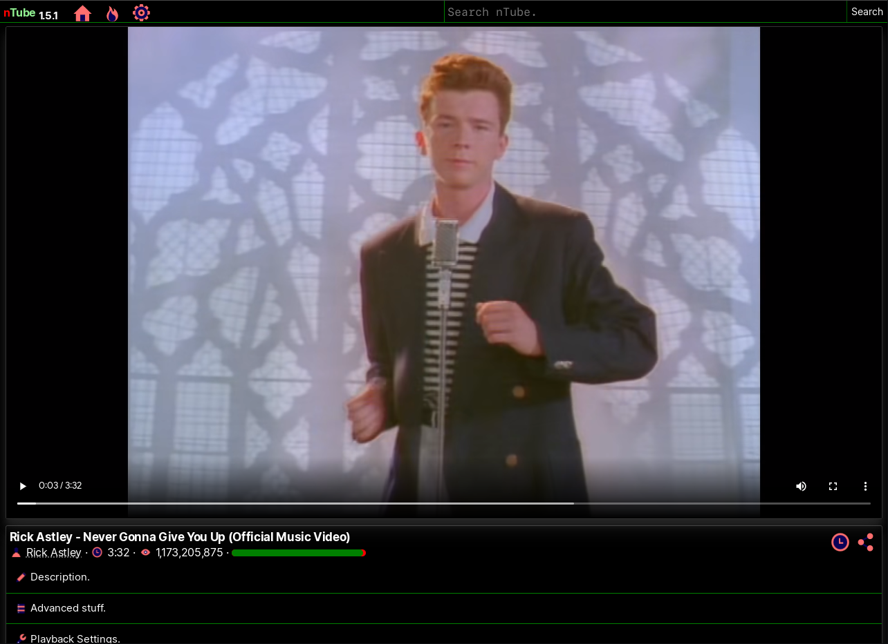

# nTube (not[You]Tube)

The sort of lightweight YouTube client.
That also supports other services.

Information:
> - Release: 1.5.0-final-rc5
- Status: Ready for testing!
- Next Planned Release: 1.5.0

## Reminder

nTube technically breaks a clause of YouTube's TOS but fully behaves like YouTube's own video player, just without any privacy intrusive crap.

nTube is in a pre-release stage and is slowly being worked on, things may break, you've been warned.

nTube is currently in an experimental state on mobile platforms.

## About

nTube is a YouTube client that allows you to interact with via your internet browser. (Unless you're on IE, your screwed)

nTube can view channels, handle subscriptions, view videos and also view playlists. (up to 200 videos)

## Features

- Supports qualities up to 8K 60fps.
- Supports downloading videos.
- AV1 codec support.
- Subtitles support. (both plain and styled)
- Experimental DRM support.
- Livestream support.
- Livestream chat support.
- Custom theme support.
- No advertising.
- No tracking.
- Trending and Search support.
- Subscriptions.
- Supports both old and new browsers.
- Sponsor blocking (data kindly provided by the SponsorBlock project)

## Supported Services

- YouTube (via page extraction, embedded extraction and internal API)
- BitChute (deprecated)

## Host Requirements

- Java (JRE) 8 or newer (up to JRE 16, newer versions are NOT supported)
- Internet access
- At least 512 MB of RAM
    - Only 128 MB is required on OpenJ9 and smaller JRE's
- Single core CPU or better

## Browser Requirements

- Support for either:
    - HTML5 video and audio tags
    - Flash Player (Supported on fallback pages only)
- HTML 5.0 support
- ECMAScript 5.0 or newer
- Media Stream Extensions (MSE) (<b>OPTIONAL</b>)

## Supported Browsers

- Chrome 30 and newer
- Firefox 20 and newer
- WebKit (WebKitGTK 2+, QtWebKit, QNXWebKit)
- Opera Presto (<b>Partial support</b>)

Other browsers should work, but you may encounter issues.

## Getting Started
1. Download a distribution of nTube.
2. (ideally in a terminal) Launch nTube.
3. nTube should be on port 8080 of localhost.

## Screenshots 📷

## Attributions
## License
Licensed under the second version of POSS. (Possibly Open Source Software License)

POSS terms:

- SOFTWARE_OS: YES
- SOFTWARE_PAID: NO
- SOFTWARE_3P_STUFF: YES
- SOFTWARE_WARRANTY: NO
- ENFORCE_TRUE_OSS: YES
- ALLOW_PAID_FREE: YES

## Code of Conduct (CoC)
Uses the second version of the CoC included in the POSS.
